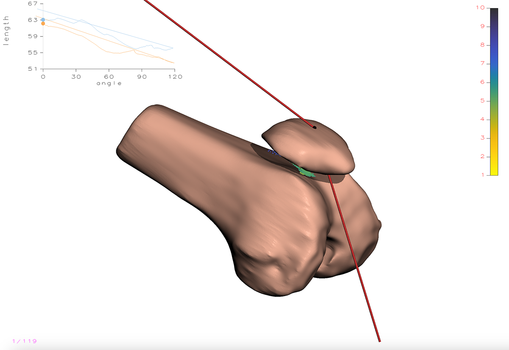
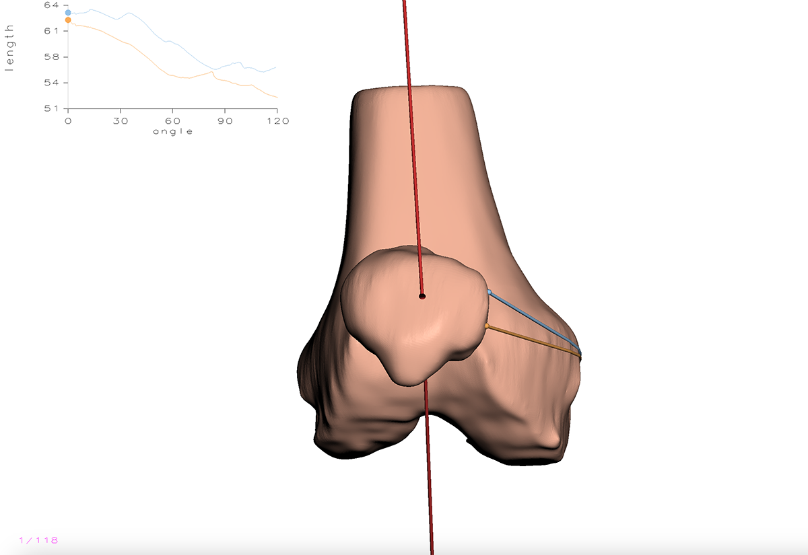

# Computer-Assisted-MPFL-Reconstruction
Sari Pagurek van Mossel (20scpv@queensu.ca)\
Supervised by Professor James Stewart for CISC 499 @ Queen's University

## Introduction
- Medial Patellofemoral Ligament (MPFL) tears are a common injury among young athletes, often resulting from forceful patella dislocation. The MPFL secures the patella to the femur and, when torn, surgical reconstruction is performed to replace the ligament. The current surgical technique relies on locating Schottle’s point as an ideal attachment site, guided largely by the surgeon’s expertise.
- This project builds on an existing knee joint model of motion by integrating forces from the quadriceps muscle and patellar tendon, which are critical to knee motion and patellar tracking. By incorporating these forces, the enhanced model aims to assist in optimizing tendon length and selecting insertion points to reduce complications like graft impingement and maintaining graft isometry.

## Original Model
- The original knee joint motion model simulates patellofemoral kinematics by calculating principal curvatures at many points between the patella and the femoral groove, and using these curvatures to cause the patella to track along the femoral groove. However, the model lacks force integration from the quadriceps muscle and patellar tendon, which are essential for accurate patellar motion simulation.

## New Model
### Implementation
- To simulate the tendons that attach the patella to the quadriceps and to the tibial tuberosity, the new model incorporates a spring and damper system representing both the femoral tendon and the patellar tendon, with flexibility to add more tendons if needed. Each tendon is modeled using Hooke’s Law to calculate elastic force and a damping force to account for energy dissipation. These calculations depend on hyperparameters, including the spring constant, damping coefficient, and the spring's rest length. For ease of use, the interface features keyboard shortcuts and zoom functionality, allowing users to select tendon endpoints efficiently. The patella endpoint is fixed to the patella bone’s local coordinate system, ensuring stability during simulations.

### Simulation
- The new model uses a physics-and-kinematics simulation which captures all the external forces affecting the patella 3D object, and calculates a series of incremental advances of the patella. With each incremental advance, the springs cause the patellar mass to oscillate until velocity and acceleration reach minimal values, indicating equilibrium. This final position is considered the optimal patellar alignment along the principal curvature groove between the springs. The calculated position and corresponding rotation transformation matrices are used to update the 3D model of the patella.
- Additionally, a slight repulsive force is applied from the skeletal separator (cartilage) between the patella and femur to prevent collision. This separator is represented by a series of points with normal vectors derived from the original principal curvature calculations, generating a small force away from the femur to maintain separation. All forces, including the separator force, are governed by weight hyperparameters to facilitate experimentation and fine-tuning of force magnitudes.

### Challenges & Model Decisions
- Given the project’s scope, the patella’s rotation is approximated about its centroid rather than using precise torque and inertia calculations. Although tendon endpoints are not necessarily perfectly located, the rotational matrix sufficiently represents movement for demonstration purposes. This simplified approach balances computational efficiency with model realism.

## Output
Positioning of the patella before and after effect of muscular and skeletal forces. Separator can be seen between the two bones.\

Before and after from top down view.\

## Run on mac
- $ cd mpfl/macos
- $ make clean
- $ make
- $ ./mpfl *path-to-data_good*/096/state.txt

Note key short cuts for model use:
- Q and W followed by CTRL-Click to select femoral tendon end points (W endpoint will lock into patella local coordinate system)
- J and U followed by CTRL-Click to select patellar tendon end points (U endpoint will lock into patella local coordinate system)
- Left and Right arrow keys to zoom in and out
- Up and Down arrow keys to rotate the patella around it's current calculated track
- A to recalculate current patella position
